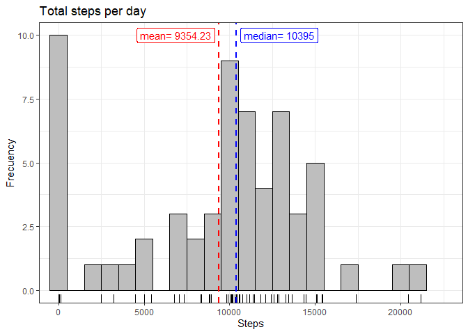
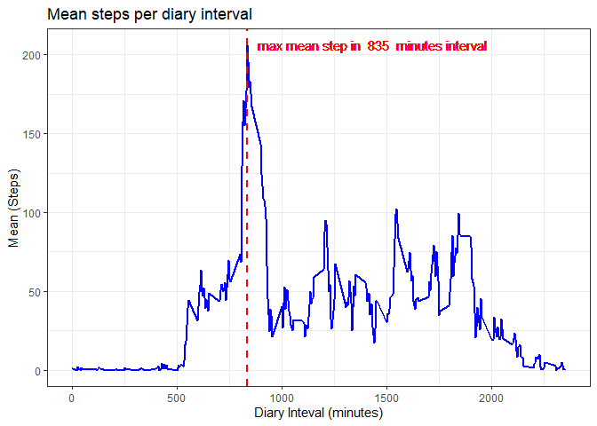
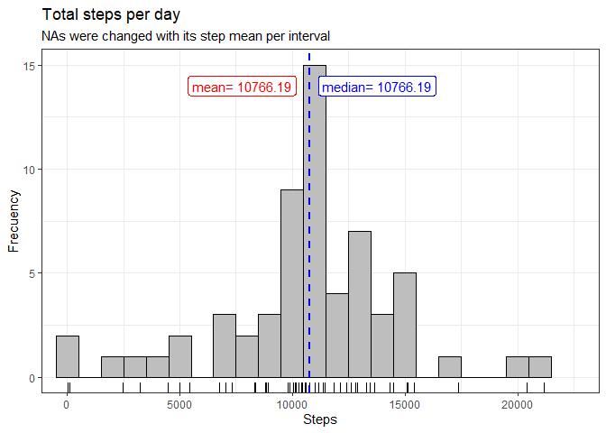
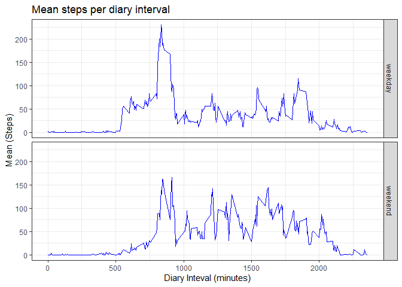

## 1. Loading and preprocessing the data
The data are compressed into activity.zip file. The firs step is unzip this file in work directory, and then it include in `initable` variable.\


```r
library("dplyr")
unzip(zipfile = "activity.zip")
initable <- read.csv("activity.csv", header = TRUE, sep = ",")
initable <- tibble(initable)
```
We describe the main `initable` dimensions 


```r
str(initable)
```

```
## tibble [17,568 x 3] (S3: tbl_df/tbl/data.frame)
##  $ steps   : int [1:17568] NA NA NA NA NA NA NA NA NA NA ...
##  $ date    : chr [1:17568] "2012-10-01" "2012-10-01" "2012-10-01" "2012-10-01" ...
##  $ interval: int [1:17568] 0 5 10 15 20 25 30 35 40 45 ...
```

```r
summary(initable)
```

```
##      steps            date              interval     
##  Min.   :  0.00   Length:17568       Min.   :   0.0  
##  1st Qu.:  0.00   Class :character   1st Qu.: 588.8  
##  Median :  0.00   Mode  :character   Median :1177.5  
##  Mean   : 37.38                      Mean   :1177.5  
##  3rd Qu.: 12.00                      3rd Qu.:1766.2  
##  Max.   :806.00                      Max.   :2355.0  
##  NA's   :2304
```
This data set are 17568 rows (observations) and three columns (variables):

- **Steps**: Number of steps taking in a 5-minute interval (missing values are coded as `NA`). There are 2304 `NA`.
- **date**: The date on which the measurement was taken. Column as character. We are going to transform it as date.
- **interval**: Identifier for the 5-minute interval in which measurement was taken. Column as integer. 


```r
initable$date <- as.Date(initable$date, "%Y-%m-%d")
```


## 2. What is mean total number of steps taken per day?
The first step is open the ggplot library.


```r
library("ggplot2")
```

### 2.1 Calculate the total number of steps taken per day and its mean and median
For this analysis, it doesn't consider the `NA` values


```r
step_day <- initable %>% group_by(date) %>% summarise(total = sum(steps, na.rm=TRUE))
mean_step <- mean(step_day$total)
median_step <- median(step_day$total)
```

### 2.2 Generate the histogram including mean and media


```r
graf_one <- ggplot(step_day, aes(total), na.rm = TRUE) +
        geom_histogram(binwidth=1000, color= "black", fill = "grey") +
        geom_rug() + 
        coord_cartesian(xlim = c(0, 22500)) +
        geom_vline(aes(xintercept=mean_step), color = "red", linetype="dashed", size=1) +
        geom_vline(aes(xintercept=median_step), color = "blue", linetype="dashed", size=1) +
        geom_label(aes(x=mean_step - 2500, y = 10, label = paste("mean=",round(mean_step,2))), color="red") + 
        geom_label(aes(x=median_step + 2500, y = 10, label = paste("median=",round(median_step,2))), color = "blue") +  
        theme_bw() + 
        labs(title="Total steps per day", x = "Steps", y="Frecuency")
graf_one
```

<!-- -->


### 2.3 Result

- The **mean** of total steps per day  is **9354.23**.
- The **median** of total steps per day is **10395**.


## 3. What is the average daily activity pattern?

### 3.1 Calculate the average of steps taken per five minutes interval
For this analysis, it doesn't consider the `NA` values


```r
step_interval <- initable %>% group_by(interval) %>% summarise(mean_interval = mean(steps, na.rm=TRUE))
```

### 3.2 Generate plot interval.vs. means steps per each interval


```r
max_mean <- max(step_interval$mean_interval)
max_step <- step_interval$interval[step_interval$mean_interval==max_mean]

graf_two <- ggplot(step_interval, aes(interval, mean_interval), na.rm = TRUE) +
        geom_line (color= "blue", size = 1) +
        geom_vline(aes(xintercept = max_step), color = "red", linetype="dashed", size=1) +
        geom_text(aes(x=max_step + 600, y = max_mean, label = paste("max mean step in ",max_step," minutes interval")), color = "red") +
        theme_bw() + 
        labs(title="Mean steps per diary interval", x = "Diary Inteval (minutes)", y="Mean (Steps)")
graf_two
```

<!-- -->

### 3.3 Result

The **835 minutes interval** has the maximun average steps with **206.17 steps**


## 4. Imputing missing values

### 4.1 Number of missing values in the dataset 


```r
length(which(is.na(initable$steps)))
```

```
## [1] 2304
```

### 4.2 New data set considering the missing values 
**Criteria**: Replace missing values with the day mean in a new data set named `newtable`


```r
na_data <- which(is.na(initable$steps))
newtable <- initable
for (i in na_data) {
        int <- newtable$interval[i]
        newtable$steps[i] <- step_interval$mean_interval[step_interval$interval == int]
}
```


### 4.3 Calculate and generate histogram with the new data set


```r
newstep_day <- newtable %>% group_by(date) %>% summarise(total = sum(steps))
newmean_step <- mean(newstep_day$total)
newmedian_step <- median(newstep_day$total)
```

We generate the same histogram that 2.2


```r
newgraf_one <- ggplot(newstep_day, aes(total)) +
            geom_histogram(binwidth=1000, color= "black", fill = "grey") +
            geom_rug() + 
            coord_cartesian(xlim = c(0, 22500)) +
            geom_vline(aes(xintercept=newmean_step), color = "red", linetype="dashed", size=1) +
            geom_vline(aes(xintercept=newmedian_step), color = "blue", linetype="dashed", size=1) +
            geom_label(aes(x=newmean_step-3000, y = 14, label = paste("mean=",round(newmean_step,2))), color="red") + 
            geom_label(aes(x=newmedian_step+3000, y = 14, label = paste("median=",round(newmedian_step,2))), color = "blue") +  
            theme_bw() + 
            labs(title="Total steps per day", subtitle="NAs were changed with its step mean per interval", x = "Steps", y="Frecuency")
newgraf_one
```

<!-- -->

### 4.4 Result
The used criteria about missing values lead to increasing mean and median step per day.
In this case, mean and median step per day are similar. The distribution is simetric. 


## 5. Are there differences in activity patterns between weekdays and weekends?

### 5.1 Create new factor (weekday/weekend)

```r
newtable <- newtable %>% 
            mutate(day = weekdays(date)) %>%
            mutate (week ="weekday") %>%
            mutate (week = replace(week, day=="domingo" | day=="sábado", "weekend")) %>%
            group_by(week, interval) %>%
            summarize(totweek = mean(steps))
```

### 5.2 Plot time serie

```r
graf_three <- ggplot(data = newtable, aes(interval,totweek), fill=week) +
        geom_line (color="blue") +
        facet_grid(week~.) +
        theme_bw() + 
        labs(title="Mean steps per diary interval", x = "Diary Inteval (minutes)", y="Mean (Steps)") +
        theme(legend.position="none")
graf_three
```

<!-- -->

### 5.3 Results

- There are some diferences between mean steps of weekdays and weekend.
- The diferences between intervals are more significant in weekdays.
